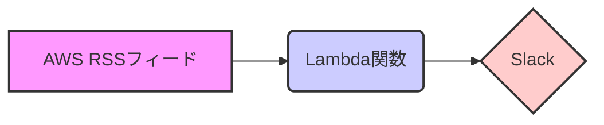

# generate-aws-weekly-update-report

AWS の週次アップデート情報を収集し、Slack に通知する CDK プロジェクトです。

## プロジェクト概要

このプロジェクトは、AWS の週次アップデート情報を収集し、指定された Slack チャンネルに通知します。
AWS の最新情報を自動的に収集し、チームに共有することで、常に最新の情報を把握できるようになります。

## 必要な環境

- AWS CLI: AWS リソースを操作するために必要です。
- CDK Toolkit: AWS CDK アプリケーションをデプロイするために必要です。
- Node.js: CDK アプリケーションの実行環境として必要です。

## インストール方法

```bash
npm install
```

## デプロイ方法

```bash
npx cdk deploy
```

## 設定方法

以下の環境変数を設定する必要があります。

- `SLACK_WEBHOOK_URL`: Slack の Webhook URL を設定します。
- `AWS_REGION`: AWS リージョンを設定します。

## スクリプトの実行方法

```bash
npm run build
npm run deploy
```

## アーキテクチャ図



## その他

CONTRIBUTING.md、LICENSE なども参照してください。
